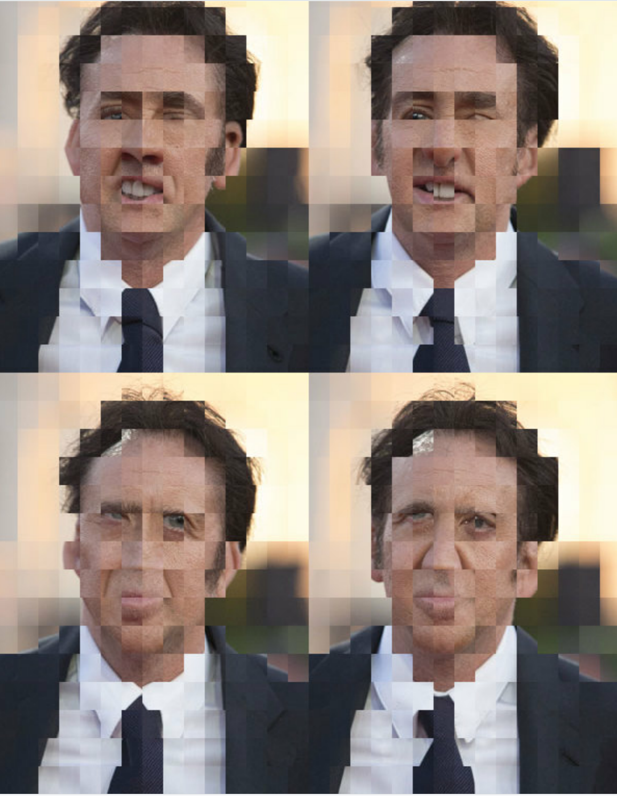

# crocodile

The goal of crocodile is to slice and rearange picture

## Installation

``` r
remotes::install_github("vincentguyader/crocodile")
```

## Example

This is a basic example which shows you how to solve a common problem:

``` r
image_read("http://fr.web.img6.acsta.net/pictures/15/07/20/18/14/582462.jpg") %>%
lens(dpi = 50)
```



